# Diagrama Entidad-Relación (DER) — MediConnect

Diagrama completo del esquema `public` sobre PostgreSQL (Supabase). La identidad base
(`auth.users`) la gestiona Supabase Auth y se referencia desde `profiles`.

> Fuente canónica: [`../diagrams/der.mmd`](../diagrams/der.mmd). Este archivo la embebe para
> render directo en GitHub/Confluence. Especificación columna por columna en
> [`esquema.md`](./esquema.md).

## Leyenda de cardinalidad (notación Mermaid)

| Símbolo | Significado |
|---------|-------------|
| `||--o|` | uno a cero-o-uno (1:1 opcional) |
| `||--o{` | uno a cero-o-muchos (1:N) |
| `PK` | clave primaria · `FK` clave foránea · `UK` clave única |

## DER completo

```mermaid
erDiagram
    %% ===== Identidad y Acceso (EP-01) =====
    profiles ||--o| patients : es
    profiles ||--o| professionals : es
    profiles ||--o{ notifications : recibe
    profiles ||--o{ push_tokens : registra
    profiles ||--o{ messages : envia

    %% ===== Catalogo y Resenas (EP-02) =====
    professionals ||--o{ professional_specialties : tiene
    specialties ||--o{ professional_specialties : agrupa
    professionals ||--o{ professional_education : declara

    %% ===== Agenda y Turnos (EP-03) =====
    professionals ||--o{ schedule_rules : define
    professionals ||--o{ schedule_blocks : bloquea
    professionals ||--o| cancellation_policies : configura
    patients ||--o{ appointments : reserva
    professionals ||--o{ appointments : atiende

    %% ===== Consulta y Videoconsulta (EP-05) =====
    appointments ||--o| consultations : deriva
    consultations ||--o| video_sessions : usa

    %% ===== Pagos (EP-04) =====
    appointments ||--o| payments : cobra
    payments ||--o{ payment_webhook_events : notifica
    payments ||--o{ refunds : reembolsa

    %% ===== Historia Clinica (EP-06) =====
    patients ||--o{ clinical_record_entries : posee
    professionals ||--o{ clinical_record_entries : registra
    consultations ||--o{ clinical_record_entries : origina
    clinical_record_entries ||--o| clinical_record_entries : corrige

    %% ===== IA Clinica (EP-07) =====
    consultations ||--o| consultation_summaries : genera
    clinical_record_entries ||--o| consultation_summaries : incorpora

    %% ===== Comunicacion (EP-08) =====
    patients ||--o{ conversations : participa
    professionals ||--o{ conversations : participa
    conversations ||--o{ messages : contiene

    %% ===== MediPass (EP-09) =====
    patients ||--o{ medipass_codes : genera
    patients ||--o{ medipass_sessions : autoriza
    medipass_codes ||--o| medipass_sessions : habilita
    medipass_sessions ||--o{ medipass_access_logs : audita

    %% ===== Resenas (EP-02) =====
    patients ||--o{ reviews : escribe
    professionals ||--o{ reviews : recibe
    appointments ||--o| reviews : habilita
    reviews ||--o| review_responses : responde

    %% ===== Plataforma y Auditoria (EP-10) =====
    profiles ||--o{ audit_logs : genera

    %% ================= ENTIDADES =================
    profiles {
        uuid id PK
        citext email UK
        user_role role
        boolean mfa_enabled
        timestamptz created_at
        timestamptz updated_at
    }
    patients {
        uuid profile_id PK, FK
        text first_name
        text last_name
        date birth_date
        varchar dni UK
        text phone
        text address
        timestamptz created_at
        timestamptz updated_at
    }
    professionals {
        uuid profile_id PK, FK
        text first_name
        text last_name
        varchar license_number
        varchar bio
        text photo_url
        numeric consultation_price
        char currency
        professional_status status
        text mercadopago_account_id
        timestamptz created_at
        timestamptz updated_at
    }
    specialties {
        uuid id PK
        text name UK
        timestamptz created_at
    }
    professional_specialties {
        uuid professional_id PK, FK
        uuid specialty_id PK, FK
    }
    professional_education {
        uuid id PK
        uuid professional_id FK
        text institution
        text degree
        smallint year
        timestamptz created_at
    }
    schedule_rules {
        uuid id PK
        uuid professional_id FK
        smallint weekday
        time start_time
        time end_time
        smallint slot_duration_minutes
        timestamptz created_at
        timestamptz updated_at
    }
    schedule_blocks {
        uuid id PK
        uuid professional_id FK
        date block_date
        text reason
        timestamptz created_at
    }
    cancellation_policies {
        uuid professional_id PK, FK
        smallint hours_full_refund
        smallint hours_partial_refund
        smallint partial_refund_percent
        timestamptz created_at
        timestamptz updated_at
    }
    appointments {
        uuid id PK
        uuid patient_id FK
        uuid professional_id FK
        timestamptz scheduled_at
        smallint duration_minutes
        numeric price
        appointment_status status
        text cancellation_reason
        timestamptz cancelled_at
        timestamptz created_at
        timestamptz updated_at
    }
    consultations {
        uuid id PK
        uuid appointment_id FK, UK
        timestamptz started_at
        timestamptz ended_at
        text professional_notes
        timestamptz created_at
    }
    video_sessions {
        uuid id PK
        uuid consultation_id FK, UK
        text daily_room_name
        text daily_room_url
        text audio_recording_url
        video_session_status status
        timestamptz started_at
        timestamptz ended_at
        timestamptz created_at
    }
    payments {
        uuid id PK
        uuid appointment_id FK, UK
        text mercadopago_preference_id
        text mercadopago_payment_id
        numeric amount
        char currency
        text method
        payment_status status
        timestamptz confirmed_at
        timestamptz created_at
    }
    payment_webhook_events {
        uuid id PK
        uuid payment_id FK
        text mercadopago_payment_id
        jsonb raw_payload
        text signature
        boolean processed
        timestamptz received_at
        timestamptz processed_at
    }
    refunds {
        uuid id PK
        uuid payment_id FK
        numeric amount
        refund_status status
        text reason
        timestamptz processed_at
        timestamptz created_at
    }
    clinical_record_entries {
        uuid id PK
        uuid patient_id FK
        uuid professional_id FK
        uuid consultation_id FK
        uuid corrects_entry_id FK
        entry_type entry_type
        text fhir_resource_type
        jsonb content
        bigint sequence_number
        char content_hash
        char previous_hash
        timestamptz created_at
    }
    consultation_summaries {
        uuid id PK
        uuid consultation_id FK, UK
        uuid validated_by FK
        uuid incorporated_entry_id FK
        text transcription_text
        jsonb summary_content
        summary_status status
        timestamptz generated_at
        timestamptz validated_at
        timestamptz created_at
    }
    conversations {
        uuid id PK
        uuid patient_id FK
        uuid professional_id FK
        timestamptz created_at
    }
    messages {
        uuid id PK
        uuid conversation_id FK
        uuid sender_id FK
        text content
        text attachment_url
        timestamptz read_at
        timestamptz created_at
    }
    notifications {
        uuid id PK
        uuid user_id FK
        notification_type type
        notification_channel channel
        jsonb payload
        timestamptz sent_at
        timestamptz read_at
        timestamptz created_at
    }
    push_tokens {
        uuid id PK
        uuid user_id FK
        text token UK
        text platform
        timestamptz created_at
    }
    medipass_codes {
        uuid id PK
        uuid patient_id FK
        varchar code
        timestamptz expires_at
        timestamptz used_at
        timestamptz created_at
    }
    medipass_sessions {
        uuid id PK
        uuid patient_id FK
        uuid medipass_code_id FK
        uuid consultant_profile_id FK
        text consultant_name
        varchar consultant_license
        timestamptz expires_at
        timestamptz revoked_at
        uuid revoked_by FK
        timestamptz started_at
    }
    medipass_access_logs {
        uuid id PK
        uuid session_id FK
        uuid patient_id FK
        text resource_accessed
        timestamptz accessed_at
    }
    reviews {
        uuid id PK
        uuid patient_id FK
        uuid professional_id FK
        uuid appointment_id FK, UK
        uuid moderator_id FK
        smallint rating
        text comment
        review_status status
        text moderation_reason
        timestamptz moderated_at
        timestamptz created_at
    }
    review_responses {
        uuid id PK
        uuid review_id FK, UK
        uuid professional_id FK
        text content
        timestamptz created_at
    }
    audit_logs {
        uuid id PK
        uuid actor_id FK
        text action
        text resource_type
        uuid resource_id
        jsonb metadata
        timestamptz created_at
    }
    integrity_checks {
        uuid id PK
        text status
        integer inconsistencies_found
        jsonb details
        timestamptz run_at
    }
```

## Notas del diagrama

- **`profiles.id` = `auth.users.id`**: relación 1:1 con la tabla gestionada por Supabase Auth
  (no se dibuja porque vive en el schema `auth`, fuera de este modelo).
- **`medipass_sessions.consultant_profile_id`** es FK opcional a `profiles`: se completa cuando
  el consultante externo *también* es usuario de la plataforma; si no, se usan los campos
  `consultant_name` / `consultant_license`. Por eso no se dibuja arista (evita ruido visual).
- **`integrity_checks`** no tiene relaciones: es una tabla de bitácora del job de verificación de
  la cadena de hash (ADR-014, TT-03 / ENG-85).
- **Auto-referencia `clinical_record_entries.corrects_entry_id`**: una entrada de tipo
  `CORRECCION` referencia a la entrada original que corrige, sin modificarla (append-only).
